# 사계절 바벨 (Babel Re-Route)

> **2026 넥슨 대학생 게임잼 「재밌넥」 2차 과제작 — 합격작**
>
> 과제 주제: *자신만의 탑뷰 디펜스 게임을 완성해 보세요!*

<p align="center">
  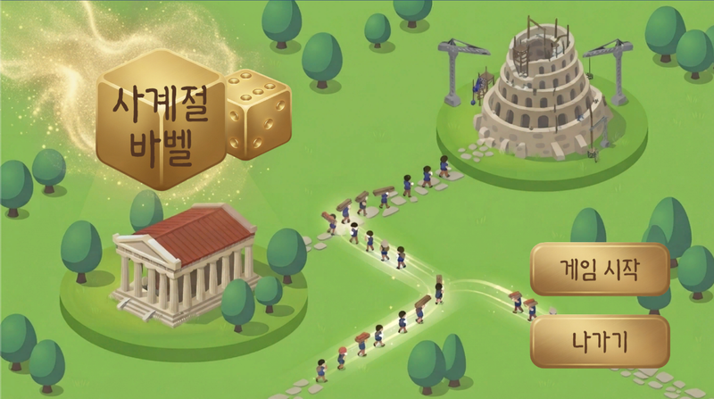
</p>

**사계절 바벨**은 플레이어가 신이 되어, 신의 권위에 도전하려는 인간들을 **아름다운 건물로 회유**해 바벨탑의 건설을 막는 **회유형 탑뷰 타워 디펜스** 게임입니다.
**2웨이브마다 계절이 바뀌고**, 계절에 따라 설치된 건물의 가치가 급변하는 것이 핵심 기믹입니다.

| 항목 | 내용 |
| --- | --- |
| 개발 기간 | 2026.07.03 ~ 2026.07.06 (4일) |
| 엔진 | Unity 6 (6000.3.4f1), URP |
| 언어 | C# |
| 사용 AI | Claude (기획·구현 플랜), Claude Code (프로그래밍), Gemini / Nano Banana (스프라이트 에셋), Suno AI (배경음악) |
| 사용 에셋 | DOTween, 서체 KNPS오대산체 · EBS주시경체, 효과음 soundeffect-lab.info |

---

## 🎮 게임 소개

### 컨셉
바벨탑을 쌓으러 몰려오는 인간을 막아야 하지만, 주인공은 **마음이 약해 인간을 해치지 못하는 신**입니다.
그래서 신은 인간을 공격하는 대신 온천·해변·벚꽃 공원 같은 **인간에게 유용하고 아름다운 건물**을 지어, 인간들이 바벨탑이 아닌 건물로 향하도록 발길을 돌립니다(Re-Route).

### 아이디어 도출
디펜스 게임의 재미를 "적을 저지하고 본진을 지키는 것"으로 정의하고, 다음 질문에서 출발했습니다.

- **"한 가지 배치가 고정되는 것이 반드시 좋은 것일까?"**
  일반적인 타워 디펜스는 건설물을 거의 교체하지 않습니다. 발상을 뒤집어 **건설물을 강제로 자주 교체해야 하는 기믹**을 만들면 새로운 재미가 생길 수 있다고 보았습니다.
- 여기서 나온 아이디어 중 **"계절에 따라 설치할 타워가 바뀌는 게임"** 의 *계절성*을 메인 기믹으로, **"바벨탑"** 을 독특한 컨셉으로 결합했습니다.
- "처음부터 바벨탑을 무너뜨리지 않고 인간만 막는 이유"를 서사적으로 납득시키기 위해 *인간을 죽이지 못하는 착한 신*이라는 설정을 확립했습니다.

<p align="center">
  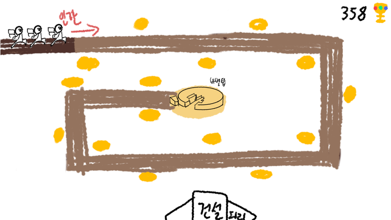
  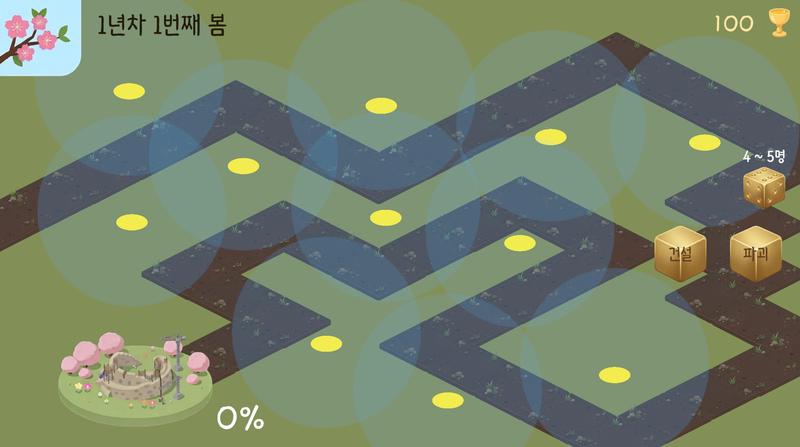
</p>

---

## 🕹️ 게임 플레이

### 게임 루프

```
정비 타임 ──▶ 실행 ──▶ 웨이브 진행 ──▶ 웨이브 종료 ──▶ 계절 전환(2웨이브마다)
(건설/파괴)   (주사위)   (인간 이동·회유)   (신앙 획득·시계 연출)        │
    ▲                                                                   │
    └───────────────────────────────────────────────────────────────────┘
                     대신전 완공 시 ▶ 엔딩 / 바벨탑 진행도 100% ▶ 게임 오버
```

1. **정비 타임** — 재화인 **신앙(Faith)** 을 소모해 건설 스폿에 건물을 짓거나 파괴합니다.
2. **실행** — 주사위가 굴러가며 이번 웨이브에 몰려올 인간 수가 확정됩니다.
3. **웨이브 진행** — 인간은 정해진 일방통행 길을 따라 바벨탑으로 향합니다. 길 위에서 건물의 상호작용 범위에 들어가고, 건물에 **정원 여유**가 있으면 건물에 들어가 일정 시간 이용한 뒤 사라집니다.
4. **웨이브 종료** — 이번 웨이브에 등장한 인간 수만큼 신앙을 얻고, 시곗바늘이 돌아가는 연출과 함께 시간이 흐릅니다.
5. **계절 전환** — 2웨이브마다 봄 → 여름 → 가을 → 겨울로 계절이 바뀌고, 건물의 정원과 외형이 달라집니다.

- **게임 오버**: 바벨탑에 도달한 인간이 쌓여 건설 진행도가 100%가 되면 패배합니다.
- **게임 클리어**: 최종 건설물인 **대신전**을 완공하면 엔딩 연출과 함께 클리어됩니다.

### 핵심 기믹 — 계절성
모든 건물은 **계절별 정원(수용 인원)** 과 **계절별 스프라이트**를 가집니다. 정원이 0인 계절에는 건물이 자동으로 폐쇄됩니다.
같은 건물도 계절에 따라 최고의 선택이 되기도, 쓸모없는 건물이 되기도 하므로 플레이어는 **매 계절 배치를 다시 고민**해야 합니다.

<p align="center">
  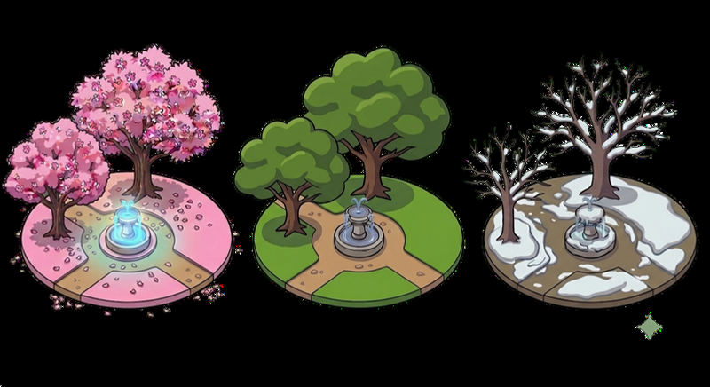
  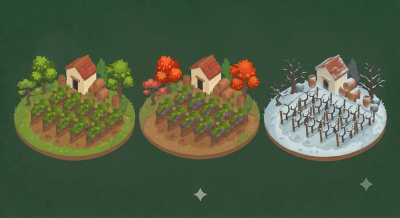
</p>

### 건물 목록

| 건물 | 비용 | 이용 시간 | 봄 | 여름 | 가을 | 겨울 | 신앙 생산 |
| --- | ---: | ---: | ---: | ---: | ---: | ---: | ---: |
| 제단 | 50 | 10s | 5 | 5 | 5 | 5 | 5 |
| 신전 | 200 | 15s | 15 | 15 | 15 | 15 | 10 |
| **대신전** (최종 목표) | 5000 | 8s | 200 | 200 | 200 | 200 | 8 |
| 벚꽃 공원 | 140 | 5s | **150** | 30 | 30 | 폐쇄 |  |
| 해변 | 150 | 7s | 30 | **200** | 30 | 10 |  |
| 폭포 | 100 | 5s | 30 | 80 | 30 | 80 |  |
| 단풍 숲 | 60 | 5s | 10 | 10 | **60** | 폐쇄 |  |
| 포도밭 | 180 | 6s | 20 | 20 | **180** | 폐쇄 |  |
| 온천 | 180 | 8s | 60 | 10 | 60 | **140** |  |
| 얼음 동굴 | 170 | 7s | 100 | 폐쇄 | 폐쇄 | **200** |  |
| 호수 | 100 | 6s | 40 | 40 | 40 | **80** |  |

- **유인용 건물**(공원·해변·온천 등)과 **생산용 건물**(제단 → 신전 → 대신전)을 분리한 경제 구조입니다. 신전 계열 건물은 인간이 이용을 마칠 때마다 신앙을 생산합니다.

### 랜덤성 — "신은 주사위를 굴리지 않는다"
웨이브마다 인간 수가 일정하게 증가하던 초기 방식은 긴장감이 부족했습니다. 아인슈타인의 말에서 착안해 **매 웨이브 인간 수에 0.9 ~ 1.4배의 랜덤 가중치**를 곱하도록 바꾸어, 몇 명이 몰려올지 예측하기 어렵게 만들었습니다. 확정된 인원은 주사위 연출로 보여줍니다.

<p align="center">
  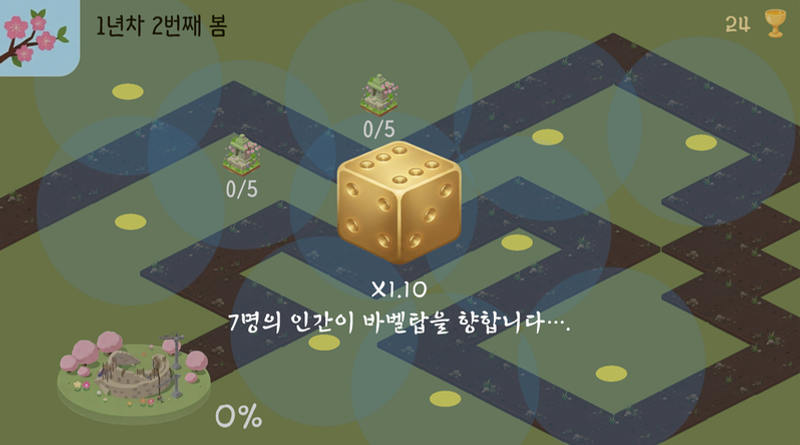
  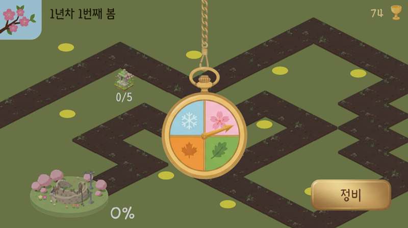
</p>

### 편의·연출 기능
- **배속 기능** — 웨이브 진행 중 우측 상단 버튼으로 진행 속도를 높일 수 있습니다.
- **대기 스킵** — 모든 인간이 건물에 들어간 뒤에는 남은 이용 대기 시간을 빠르게 흘려 후반 웨이브의 루즈함을 줄였습니다.
- **건물 정보 툴팁** — 건물에 커서를 올리면 계절별 정원, 비용 등 상세 정보가 표시됩니다.
- **시계 연출** — 웨이브가 끝나면 시곗바늘이 돌아가며 시간(계절)의 흐름을 시각적으로 보여줍니다.
- **11단계 튜토리얼** — UI, 건설·파괴, 실행, 계절성의 의미를 순서대로 안내합니다.
- **타이틀 / 엔딩** — 타이틀 화면부터 대신전 완공 엔딩까지 완결된 구조를 갖추었습니다.

<p align="center">
  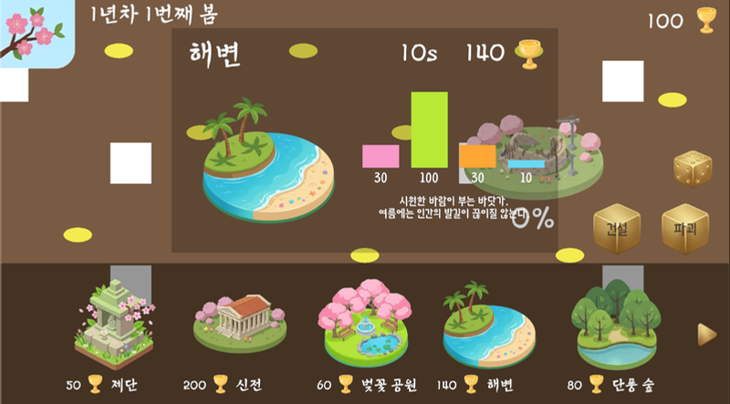
  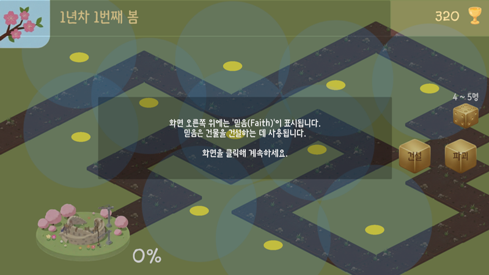
</p>

---

## 🛠️ 구현

### 프로젝트 구조

```
Assets/
├── 01_Scenes/          # Title, GameScene
├── 02_Scripts/
│   ├── MainGame/
│   │   ├── Building/   # BuildingSO, BuildingCatalog, BuildSpot,
│   │   │               # ConstructionModeController, WorldClickHandler
│   │   ├── Human/      # HumanAgent, SimpleSpawner, HumanSpriteAnimator
│   │   ├── Way/        # WaypointPath
│   │   ├── UI/         # 건설 패널, 신앙/진행도/계절 시계, 배속, 결과 패널 등
│   │   ├── GameStateManager.cs
│   │   ├── CameraSeasonBackground.cs
│   │   └── EndingController.cs
│   ├── Tutorial/       # TutorialManager, TutorialSequenceSO, TutorialSignals ...
│   ├── Title/
│   └── Sound/          # AudioManager, ButtonSFX
├── 03_Prefab/
├── 04_Datas/           # 건물 ScriptableObject, 튜토리얼 시퀀스
├── 05_Resources/       # 스프라이트, 사운드
├── 06_Fonts/
└── Editor/             # BuildingCsvUtility (SO ↔ CSV), TutorialSequenceFactory
```

### 주요 시스템

**맵 & 인간 이동**
- 맵은 *길*, *건설 스폿*, *목적지(바벨탑)* 로 구성됩니다. 길은 갈림길이 없는 일방통행 직선 경로이므로, NavMesh 없이 `WaypointPath`의 순서 있는 Transform 리스트를 순회하는 방식으로 구현했습니다.
- `HumanAgent`는 `Walking / Waiting / UsingFacility / Despawned` 상태를 가진 간단한 상태 머신으로, 웨이포인트를 등속으로 이동하다가 조건이 맞는 건물을 만나면 시설 이용 상태로 전환됩니다.

**건설 시스템** — 데이터 / 스폿 / 컨트롤러 / 입력 계층으로 책임을 분리했습니다.
| 클래스 | 역할 |
| --- | --- |
| `BuildingSO` | 건물의 기본 정보, 비용, 이용 시간, 신앙 생산량, 계절별 정원·스프라이트 |
| `BuildSpot` | 위치별 설치·파괴, 정원 관리, 이용 대기열 처리 |
| `ConstructionModeController` | 건설 모드 / 파괴 모드 전환 |
| `WorldClickHandler` | 마우스 입력을 읽어 상황에 맞는 동작으로 연결 |

**게임 상태** — `GameStateManager`가 신앙·웨이브·계절·바벨탑 진행도를 관리하고 이벤트(`OnFaithChanged`, `OnSeasonChanged`, `OnWaveChanged`, `OnGameOver` 등)를 발행하며, UI와 건물은 이를 구독해 갱신됩니다.

**튜토리얼** — `TutorialSequenceSO`에 단계 데이터를 정의하고, `TutorialSignals`로 게임 내 이벤트(버튼 클릭, 건설 완료 등)를 받아 다음 단계로 진행합니다.

### 커스텀 에디터 — SO ↔ CSV 양방향 변환
ScriptableObject를 하나씩 수정하는 불편함을 해결하기 위해, 건물 SO와 CSV 파일을 **양방향으로 변환**하는 에디터 툴(`Assets/Editor/Buildingcsvutility.cs`)을 제작했습니다. 스프레드시트에서 스탯을 일괄 수정한 뒤 SO에 적용할 수 있어, 짧은 개발 기간에도 밸런스 조정을 빠르게 반복할 수 있었습니다.

<p align="center">
  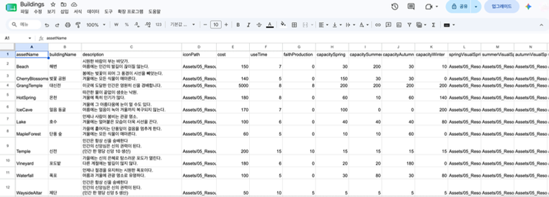
</p>

---

## 🤖 AI 활용 방식

| 단계 | 도구 | 활용 |
| --- | --- | --- |
| 기획 | Claude | 아이디어를 HTML 기획서로 정리, 건물 후보 18종 브레인스토밍, 시스템별 구현 플랜 수립 |
| 구현 | Claude Code | Claude가 작성한 구현 요청문을 기반으로 전체 프로그래밍 |
| 아트 | Gemini + Nano Banana | 기준 아트(해변)의 스타일을 프롬프트로 추출해 에셋 전반의 통일감 확보, 인게임에서 작게 보이는 점을 고려해 디테일을 줄이고 핵심 요소를 강조 |
| 사운드 | Suno AI | 경쾌한 배경음악 제작 |

---

## 📅 개발 일정

| 날짜 | 작업 |
| --- | --- |
| 7/3 | 기획 정리, 인게임 컨셉아트, 프로젝트 생성, 이동·건설 시스템 골격 |
| 7/4 | 계절성·메인 루프 구현, AI 아트/사운드 제작 및 적용 |
| 7/5 | 부가 기능(배속, 주사위, 시계 연출, 튜토리얼, 타이틀·엔딩) 및 밸런스 조정 |
| 7/6 | 최종 테스트 및 제출 |

<p align="center">
  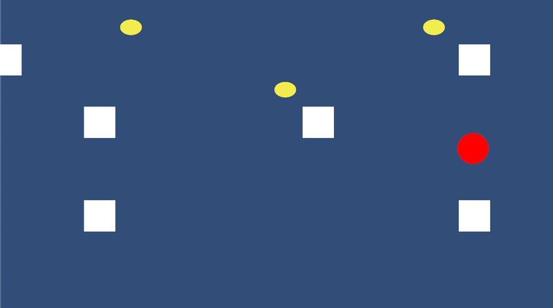
  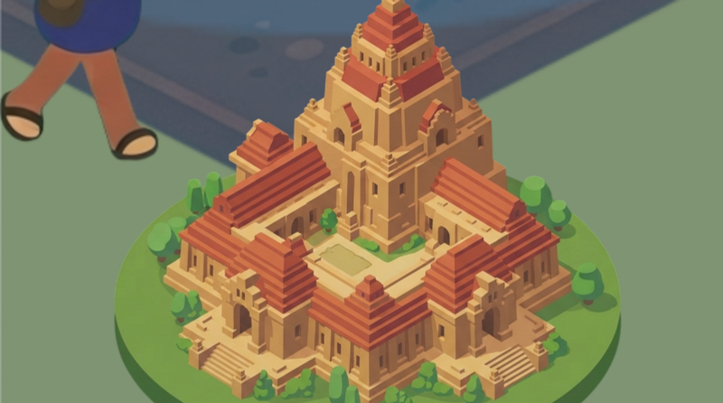
</p>
<p align="center"><sub>초기 프로토타입(흰색: 길, 노란색: 건설 스폿, 빨간색: 인간) → 최종 목표 건물 '대신전'</sub></p>

---

## ▶️ 실행 방법

1. **Unity 6000.3.4f1** 이상으로 프로젝트를 엽니다.
2. 서체 라이선스 문제로 폰트 파일은 저장소에 포함하지 않았습니다. KNPS오대산체, EBS주시경체를 내려받아 `Assets/06_Fonts/`에 넣고 TextMesh Pro Font Asset(`KNPSOdaesan SDF`, `EBS주시경M SDF`)을 생성해 주세요.
3. `Assets/01_Scenes/Title.unity` 씬을 열고 Play 합니다.

---

## 📜 크레딧
- 개발: 이예은
- 서체: KNPS오대산체, EBS주시경체
- 트위닝: [DOTween](http://dotween.demigiant.com/) (Demigiant)
- 효과음: [soundeffect-lab.info](https://soundeffect-lab.info/)
- 배경음악: Suno AI로 제작
